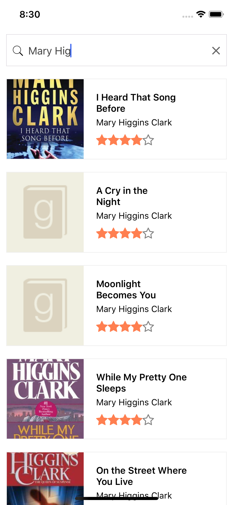

# React Native Book Search
React Native Book Search is an 
app that integrates with Elastic 
search via 
[appbase.io](http://appbase.io). 
The elastic search database used 
in this app contains roughly 
9,400 books. 

 
Elastic search provides indexing 
features to our database that 
makes searching through a large 
list of list a breeze. Searching 
is done without having to 
refresh any part of the 
application. The update is 
realtime.
# Features
- Realtime search 
- Beautiful UI
# Screenshots

Credits : [Tutorial](https://hackernoon.com/building-an-e-commerce-search-app-with-react-native-2c87760a2315)
